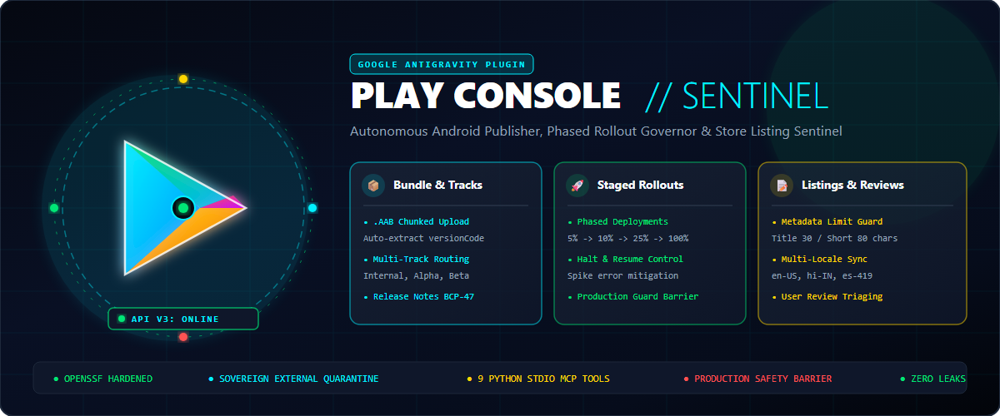

# 📱 antigravity-play-console-plugin

<p align="center">
  
</p>

<p align="center">
  <a href="https://github.com/karansinghverma979/antigravity-play-console-mcp/actions/workflows/ci.yml">
    
  </a>
  <a href="https://securityscorecards.dev">
    
  </a>
  <a href="https://opensource.org/licenses/MIT">
    
  </a>
  <a href="https://www.python.org/downloads/">
    
  </a>
  <a href="#">
    
  </a>
  <a href="https://github.com/karansinghverma979/antigravity-play-console-mcp">
    
  </a>
  <a href="#">
    
  </a>
</p>

> **Autonomous Google Play Console Release Sentinel, Phased Rollout Governor & Android Publisher Plugin for Google Antigravity.**

An enterprise-grade Antigravity plugin engineered to give AI agents and developers programmatic, deterministic control over the **Google Play Developer API v3**. Deploy Android App Bundles (`.aab`), orchestrate staged rollouts (`internal`, `alpha`, `beta`, `production`), manage localized store presences, and triage user reviews with guaranteed sovereign credential quarantine.

---

## 🎨 Brand Assets & Design Poster

The repository comes equipped with high-resolution vector and raster branding assets designed for GitHub releases, docs, and banners:

| Asset | Type | Dimensions | Preview / File Link |
| :--- | :--- | :--- | :--- |
| **Hero Poster / Banner** | Vector SVG & Rendered PNG | 1200 × 500 | [`assets/poster.svg`](assets/poster.svg) • [`assets/poster.png`](assets/poster.png) |
| **Brand Logo / Icon** | Vector SVG & Rendered PNG | 512 × 512 | [`assets/logo.svg`](assets/logo.svg) • [`assets/logo.png`](assets/logo.png) |
| **Compact Banner** | Vector SVG | 1200 × 500 | [`assets/banner.svg`](assets/banner.svg) |

---

## 🏛️ Architecture

```
antigravity-play-console-plugin/
├── .github/
│   ├── ISSUE_TEMPLATE/
│   │   ├── bug_report.yml                 # Interactive GitHub bug report form
│   │   └── feature_request.yml            # Interactive GitHub feature request form
│   ├── workflows/
│   │   └── ci.yml                         # OpenSSF-hardened CI pipeline
│   ├── PULL_REQUEST_TEMPLATE.md           # Security & safety checklist
│   └── dependabot.yml                     # Automated dependency scanner
├── agents/
│   └── play_console.md                    # Declarative Antigravity Agent definition
├── assets/
│   ├── banner.svg                         # Vector header banner
│   ├── logo.png                           # Rendered 512x512 PNG icon
│   ├── logo.svg                           # Scalable vector logo icon
│   ├── poster.png                         # Rendered 1200x500 hero poster
│   └── poster.svg                         # Scalable vector hero poster
├── mcp/
│   ├── __init__.py                        # Package init
│   ├── client.py                          # Google Play Developer API v3 engine
│   └── server.py                          # Pure Python stdio JSON-RPC MCP server
├── rules/
│   └── AGENTS.md                          # Mandatory safety invariants (Rollouts & Quarantine)
├── skills/
│   └── play-console/
│       ├── SKILL.md                       # Antigravity Skill instructions & router
│       └── references/
│           ├── api_troubleshooting.md     # Error codes & permission runbook
│           ├── store_listing_guide.md     # Localization & character limits
│           └── track_rollout_playbook.md  # Phased rollout percentages (5% -> 100%)
├── hooks.json                             # Pre-flight production release safety check
├── mcp_config.json                        # Declarative MCP server registration
├── plugin.json                            # Antigravity Plugin manifest
├── pyproject.toml                         # Packaging specification
├── requirements.txt                       # Core dependencies
├── service_account.example.json           # Sanitized schema template (Zero secrets)
├── .gitattributes                         # Line-ending firewall (CRLF for PS1, LF for rest)
├── .gitignore                             # Sovereign secret shield & artifact filter
├── LICENSE                                # MIT License
├── SECURITY.md                            # OpenSSF vulnerability disclosure policy
└── README.md
```

---

## ⚡ Core Capabilities

```
┌────────────────────────────────────────────────────────────────────────┐
│                        PLAY CONSOLE GOVERNANCE                         │
├───────────────────┬───────────────────┬────────────────────────────────┤
│ 🔑 ZERO KEY LEAKS │ 🚀 STAGED ROLLOUT │ 📝 METADATA COMPLIANCE         │
├───────────────────┼───────────────────┼────────────────────────────────┤
│ • External Keys   │ • Internal First  │ • Title ≤ 30 Chars             │
│ • No Keys in Git  │ • Phased Rollouts │ • Short Desc ≤ 80 Chars        │
│ • %LOCALAPPDATA%  │ • Operator Barrier│ • Full Desc ≤ 4000 Chars       │
└───────────────────┴───────────────────┴────────────────────────────────┘
```

1. **📦 Android App Bundle (.aab) Uploader (`play_upload_bundle`)**:
   - Streamed chunked uploads to Google Play Console with automatic extraction and validation of assigned `versionCode`.

2. **🚀 Track Management & Phased Rollouts (`play_create_release`, `play_list_tracks`)**:
   - Seamlessly targets `internal`, `alpha`, `beta`, and `production` tracks.
   - Enforces staged rollout fractions (`user_fraction` between `0.05` [5%] and `1.0` [100%]) to eliminate catastrophic single-point release bugs.

3. **📝 Store Listing Governor (`play_update_listing`, `play_get_listings`)**:
   - Enforces policy character constraints: Title (≤ 30 chars), Short Description (≤ 80 chars), Full Description (≤ 4,000 chars).
   - Supports multi-lingual localization via standard BCP-47 tags (`en-US`, `hi-IN`, `es-419`, `de-DE`).

4. **⭐ Review Intelligence & Customer Support (`play_list_reviews`, `play_reply_review`)**:
   - Paginated review extraction, rating analysis, and automated, brand-aligned developer responses.

5. **🔍 Health & Diagnostic Check (`play_check_status`)**:
   - Instant verification of Google Play Developer API v3 connectivity and active service account identity.

---

## 🔑 Sovereign External Credential Quarantine

To guarantee zero accidental git leaks and survive complete repository wipes (`git clean -fdx`), Google Play service account keys reside strictly **outside the repository working tree**:

### Quarantine Locations (Auto-resolved in order):
1. Environment Variable: `PLAY_CONSOLE_KEY_PATH`
2. Environment Variable: `GOOGLE_APPLICATION_CREDENTIALS`
3. Primary External Quarantine:
   - **Windows**: `%USERPROFILE%\.gemini\keys\google-play-service-account.json`
   - **Linux / macOS**: `~/.gemini/keys/google-play-service-account.json`
4. Secondary External Quarantine: `~/.gemini/config/play_console/service_account.json`

> [!IMPORTANT]
> The engine **never** looks inside the repository tree for credentials. The working tree is 100% immune to key leaks.

---

## 🚀 Installation & Antigravity Setup

### Option 1: Global Plugin Directory (Recommended)

Clone or copy this repository into your user Antigravity plugin directory:

```powershell
git clone https://github.com/karansinghverma979/antigravity-play-console-mcp.git "$env:USERPROFILE\.gemini\config\plugins\play-console-plugin"
```

Once placed, Antigravity automatically:
- Registers the `play-console` MCP server via `mcp_config.json`.
- Registers the `play_console` agent.
- Activates the `play-console` skill and safety invariants across all sessions.

### Option 2: Standalone MCP Client (Claude Desktop / Cursor)

Add to your MCP client configuration file:

```json
{
  "mcpServers": {
    "play-console": {
      "command": "python",
      "args": [
        "mcp/server.py"
      ],
      "env": {
        "PLAY_CONSOLE_KEY_PATH": "~/.gemini/keys/google-play-service-account.json"
      }
    }
  }
}
```

---

## 🤖 Antigravity Agent Usage

You can invoke the agent directly inside Antigravity conversations:

```
@play_console check API status and verify the latest release on the internal track
```

Or deploy an Android App Bundle:

```
@play_console upload build/app/outputs/bundle/release/app-release.aab for com.example.app and create a 10% staged rollout on production
```

---

## 🔒 Security & Privacy

- **Zero Secret Commits**: Key search paths completely exclude repository directories.
- **Production Confirmation Barrier**: Pre-flight hooks require explicit user confirmation before committing production track releases.
- **OpenSSF Hardened**: All CI workflows run with `permissions: contents: read` and pinned 40-character action commit SHAs.

---

## 📄 License

MIT License. See [LICENSE](./LICENSE) for details.
